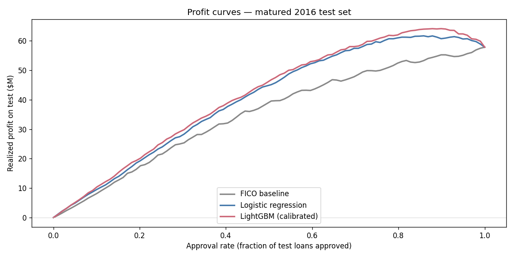
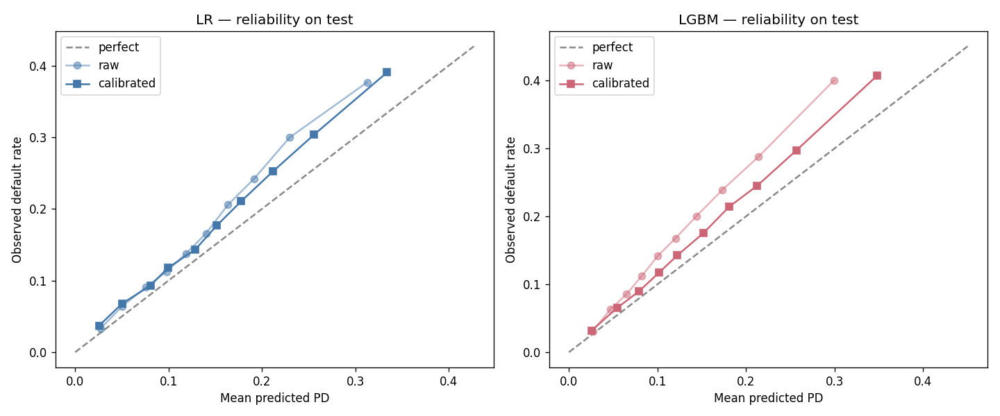
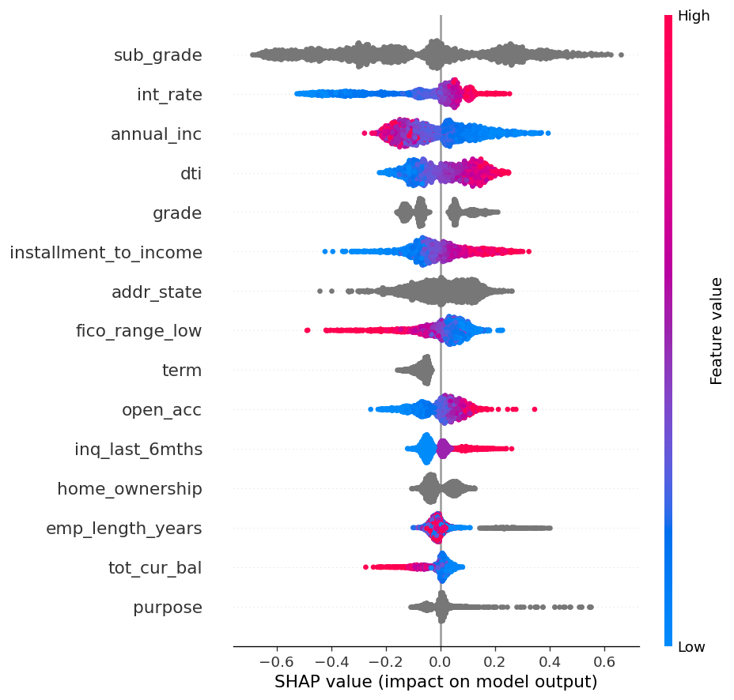
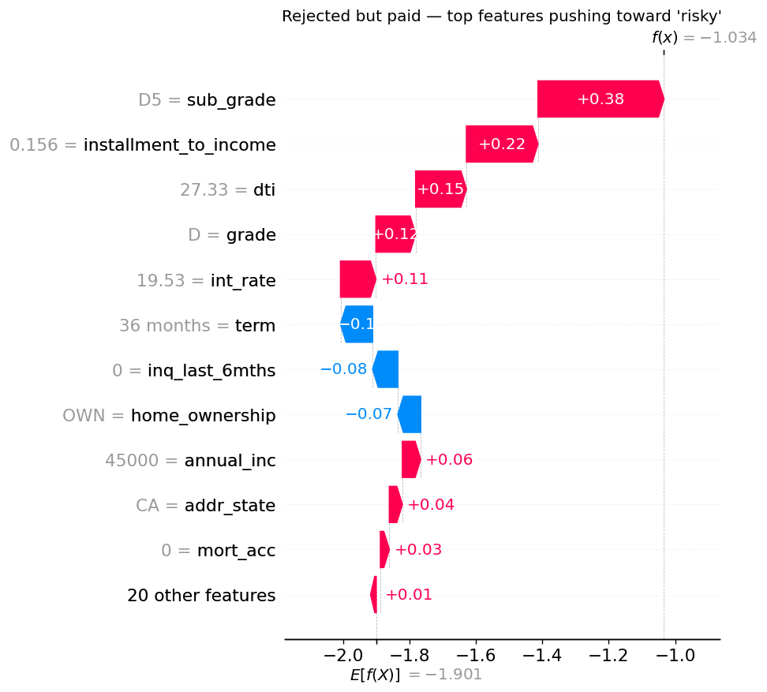
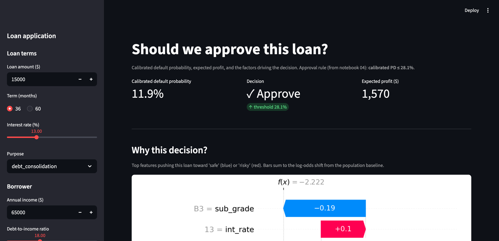

# Should we approve this loan?

A credit risk model on Lending Club data, framed as a **profit-optimization problem** rather than a pure classification exercise. The model decides which loans to approve, and is evaluated on realized profit over a held-out 2016 cohort.

## Findings

**Headline:** calibrated LightGBM delivers **$64.1M realized profit** on the 2016 test set vs **$57.9M for approve-all**, a **+10.9% lift** by rejecting the riskiest ~10% of loans at a calibrated PD threshold of 28%. Default rate among approved drops from 17.3% → 14.7%.



| policy | approval rate | profit | $/loan | default rate |
|---|---:|---:|---:|---:|
| approve-all (FICO≥660) | 100% | $57.9M | $530 | 17.3% |
| Logistic regression | 86% | $61.7M | $658 | 14.2% |
| **LightGBM (calibrated)** | **90%** | **$64.1M** | $653 | 14.7% |

**Calibration matters.** Raw LightGBM under-predicts risk at the top end (predicts 30%, observes 40%). Isotonic regression on a held-out fold closes the gap; without it the expected-profit math falls apart and the model picks a worse operating point.



**Fairness: one honest flag.** The lowest-income bracket (<$40k) is approved at 78% of the rate of $80–120k earners, just below the 80% disparate-impact threshold. The bracket's realized default rate is also higher (18.3% vs 12.6% among approved), so the gap is partly risk-explained, but it remains a real tension between risk-based underwriting and equitable access, surfaced rather than buried.

**A real-world data trap.** Naïve test economics looked catastrophic (-$725/loan). Diagnosis: maturity censoring on 2016–2018 vintages, where only early prepayers and early defaulters had finalized by the dataset snapshot. Filtering to loans whose full term had elapsed flipped the baseline to +$530/loan and made the rest of the analysis meaningful.

## Explainability

Global SHAP attributions across the test set: interest rate, DTI, and FICO dominate as expected; subgrade and term carry meaningful weight after that.



Per-loan explanation for a notable error: a loan the calibrated model approved that ended up defaulting. The decomposition shows which features pulled the predicted PD below threshold.



## Notebooks

| # | Notebook | What it does |
|---|---|---|
| 01 | [EDA](notebooks/01_eda.ipynb) | Vintage default trends, leakage audit, **maturity-bias diagnosis**, baseline profit policies |
| 02 | [Features](notebooks/02_features.ipynb) | Feature engineering, missingness audit, persist train/test parquet |
| 03 | [Modeling](notebooks/03_modeling.ipynb) | Logistic regression + LightGBM, **reliability diagrams** |
| 04 | [Calibration & profit](notebooks/04_calibration_profit.ipynb) | Isotonic calibration, **profit curves**, optimal operating point (the centerpiece) |
| 05 | [Fairness & SHAP](notebooks/05_fairness_explainability.ipynb) | Disparate-impact audit, SHAP global + local explanations |

## Dashboard

A Streamlit app that takes a loan application, predicts the calibrated default probability, computes expected profit, and shows the SHAP factors driving the decision.



```bash
uv run streamlit run dashboard/app.py
```

## The question, framed economically

A loan that is paid back earns interest. A loan that defaults loses (most of) the principal. So the right objective isn't "predict default"; it's "approve the set of loans that maximizes expected profit."

For each loan `i` with predicted default probability `p_i`:

```
expected_profit_i = (1 - p_i) * interest_earned_i  -  p_i * loss_given_default_i
```

A model is useful only if it produces better approval decisions than the FICO-cutoff baseline. Profit curves at varying approval rates make this comparison directly.

## Data

[Lending Club loan data on Kaggle](https://www.kaggle.com/datasets/wordsforthewise/lending-club): ~2M issued loans 2007–2018Q4 with terms, borrower attributes, and repayment outcomes.

**Temporal split (no random k-fold):**
- Train: loans issued 2007–2015 whose full term had elapsed by the snapshot
- Test: matured 36-month loans issued Jan–Apr 2016

Random splits leak future information into training and inflate metrics, a classic finance ML failure mode.

## Project structure

```
.
├── README.md
├── pyproject.toml
├── data/
│   ├── raw/              # Lending Club CSV (gitignored)
│   └── processed/        # train.parquet, test.parquet (gitignored)
├── notebooks/            # 01–05, runnable end-to-end
├── credit_risk/          # Reusable Python: data, features, models, economics, fairness
├── dashboard/app.py      # Streamlit decision support
├── figures/final/        # Curated charts referenced in the README
└── models/               # lightgbm.txt booster (tracked); .joblib calibrators (gitignored)
```

## Setup

```bash
uv sync                                       # install deps (creates .venv)
brew install libomp                           # LightGBM needs OpenMP on macOS
# Place the Lending Club CSV at data/raw/accepted_2007_to_2018Q4.csv
uv run jupyter lab                            # launch notebooks
uv run streamlit run dashboard/app.py         # launch dashboard
```

## Design decisions worth defending

- **Walk-forward, not k-fold.** Default-rate distributions shift across vintages; random splits leak the future.
- **Maturity filtering.** Naïve completion-based filtering biased test economics by ~$1,250/loan. Filtering by elapsed term fixed it.
- **Calibration matters more than AUC.** Expected-profit math needs probabilities, not rankings. Isotonic regression on a held-out fold.
- **Profit curves > ROC.** A model that wins on AUC can lose on profit if its score distribution is wrong in the high-stakes tail.
- **Fairness audit, not just feature importance.** Approval-rate parity, default-rate parity, and disparate impact across socioeconomic proxies.
- **SHAP for individual decisions.** Global feature importance is a one-liner; per-loan explanations are what a credit officer actually needs.

## Limitations

- Lending Club only shows *approved* loans, so the model is trained on a selection-biased population.
- The maturity filter leaves a narrow test set: ~109k 36-month loans issued Jan–Apr 2016. A broader test would strengthen the conclusions.
- "Loss given default" comes directly from realized payments; a deployment model would forecast LGD as its own problem.
- No macroeconomic features; performance across regimes (e.g. recessions) is untested.
- Race and gender aren't in the public data, so the fairness audit only uses socioeconomic proxies (income, employment, geography).
